# Entity Relationship Diagram (ERD) - sse_festa_db

Centralized MySQL Relational Database for **Saranathan College of Engineering (SSE FESTA)**.

---

## 1. High-Level Entity Relationship Diagram (Mermaid)

```mermaid
erDiagram
    DEPARTMENTS ||--o{ COURSES : "offers"
    DEPARTMENTS ||--o{ FACULTY : "employs"
    DEPARTMENTS ||--o{ TIMETABLES : "manages"
    DEPARTMENTS ||--o| RESEARCH_CENTRES : "operates"

    DEPARTMENTS {
        int dept_id PK
        string dept_code UK
        string dept_name
        string hod_name
        string email
        string phone
        string source_url
    }

    COURSES {
        int course_id PK
        string course_name
        string degree
        string duration
        int dept_id FK
        int intake
        enum programme_type
        string source_url
    }

    FACULTY {
        int faculty_id PK
        string faculty_name
        string designation
        int dept_id FK
        string qualification
        string research_area
        string email
        string phone
        string source_url
    }

    TIMETABLES {
        int timetable_id PK
        int dept_id FK
        string semester
        string academic_year
        string pdf_url
        date last_updated
        string source_url
    }

    RESEARCH_CENTRES {
        int centre_id PK
        string centre_name UK
        int dept_id FK
        string coordinator
        string description
        string source_url
    }

    ACADEMIC_CALENDAR {
        int calendar_id PK
        string academic_year
        string semester
        string event_name
        date event_date
        string description
        string source_url
    }

    EXAM_NOTICES {
        int notice_id PK
        string notice_title
        date notice_date
        string semester
        string pdf_link
        string source_url
    }

    ANNOUNCEMENTS {
        int announcement_id PK
        string title
        string category
        date publish_date
        string attachment_url
        string source_url
    }

    PLACEMENT_DRIVES {
        int drive_id PK
        string company_name
        date drive_date
        string eligibility
        string package_offered
        string registration_link
        string status
        string source_url
    }

    CLUBS {
        int club_id PK
        string club_name UK
        string category
        string faculty_coordinator
        string contact_email
        string source_url
    }

    GALLERY {
        int gallery_id PK
        string image_title
        string event_name
        string category
        string image_url
        string source_url
    }

    CAMPUS_BUILDINGS {
        int building_id PK
        string building_name UK
        string building_type
        string location
        string source_url
    }

    CONTACT_INFORMATION {
        int contact_id PK
        string office_name
        string address
        string phone
        string email
        string website
        string source_url
    }
```

---

## 2. Table Specifications & Cardinality

| Table Name | Entity Description | Primary Key | Foreign Keys | Relationships |
| :--- | :--- | :--- | :--- | :--- |
| `departments` | Academic & non-academic departments | `dept_id` | None | 1:N with `courses`, `faculty`, `timetables`; 1:1/1:N with `research_centres` |
| `courses` | Degree programs (UG, PG, PhD) | `course_id` | `dept_id` -> `departments.dept_id` | N:1 with `departments` |
| `faculty` | Teaching staff members | `faculty_id` | `dept_id` -> `departments.dept_id` | N:1 with `departments` |
| `academic_calendar` | Institutional term events & exam dates | `calendar_id` | None | Independent module |
| `exam_notices` | Controller of Examinations notices | `notice_id` | None | Independent module |
| `timetables` | Department-wise semester schedules | `timetable_id` | `dept_id` -> `departments.dept_id` | N:1 with `departments` |
| `announcements` | General circulars & news notifications | `announcement_id` | None | Independent module |
| `placement_drives` | Recruitment events & job drives | `drive_id` | None | Independent module |
| `clubs` | Institutional cells, clubs & societies | `club_id` | None | Independent module |
| `research_centres` | Recognized R&D facilities | `centre_id` | `dept_id` -> `departments.dept_id` | N:1 with `departments` |
| `gallery` | Campus & event media archive | `gallery_id` | None | Independent module |
| `campus_buildings` | Physical infrastructure & campus blocks | `building_id` | None | Independent module |
| `contact_information` | Office contacts & helpdesk numbers | `contact_id` | None | Independent module |

---

## 3. Database Normalization (3NF Justification)

1. **First Normal Form (1NF)**:
   - All columns hold atomic, non-divisible values.
   - Primary keys (`AUTO_INCREMENT`) uniquely identify every record in each table.
   - No repeating groups or array attributes stored as comma-separated text.

2. **Second Normal Form (2NF)**:
   - All non-key attributes fully depend on the single primary key of each table.
   - Foreign key relationships (`dept_id`) separate repeating departmental attributes from entity-specific details.

3. **Third Normal Form (3NF)**:
   - Eliminated transitive dependencies. Department name, email, and HOD details exist exclusively inside the `departments` table and are referenced by `dept_id` in `faculty`, `courses`, `timetables`, and `research_centres`.
